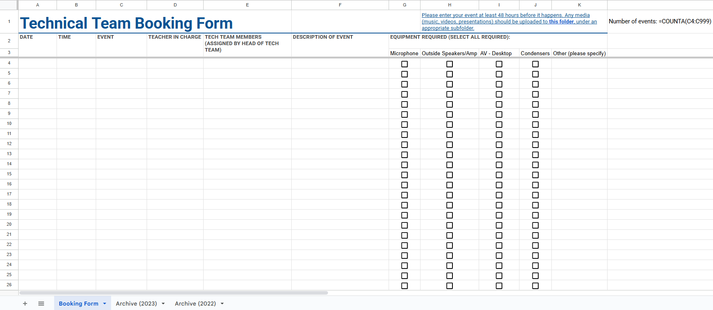

# Spreadsheet Form Layout Reference

This Google Apps Script project requires the primary "Booking Form" sheet to adhere to the following column structure for correct sorting and archiving. Use with a different layout requires modification.

**Key Requirements:**
* **Date:** Must be in the **first column (A)** for the archive function to work.
* **Data Start:** Event data processing begins on **Row 4**.

## Screenshot Reference

*NOTE: the COUNTA function in L1 should be functional. It is merely shown for demonstration purposes.
